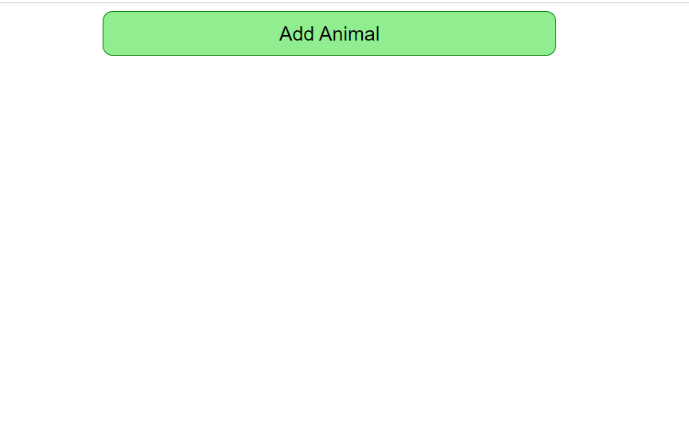

# Animal Clicker App

This is a simple React application that displays random animals with heart icons. Every time you click on an animal, the heart icon increases in size, showing how much you "love" that animal.

## Features

- **Add Animal**: Click the "Add Animal" button to randomly select and display a new animal.
- **Click to Grow Heart**: Each animal has a heart icon that increases in size each time the animal is clicked.

## Screenshots

### Initial State


### After Adding Animals


### Heart Grows on Click


## How to Run the Project

1. **Clone the repository**:
    ```bash
    git clone https://github.com/Srikar4510/AnimalsApp.git
    cd AnimalsApp
    ```

2. **Install dependencies**:
    ```bash
    npm install
    ```

3. **Run the application**:
    ```bash
    npm start
    ```

4. **Open your browser** and go to `http://localhost:5173`.

## Code Overview

### `App.js`

This file contains the main application logic. It handles the state of the list of animals and renders the `AnimalShow` components.

### `AnimalShow.jsx`

This component handles the display of individual animals. It tracks how many times the animal has been clicked and increases the size of the heart icon accordingly.

### `getRandomAnimal`

A helper function that randomly selects an animal from the available list.

### Styling

The application uses basic CSS for layout and styling. You can find the styles in `App.css` and `AnimalShow.css`.

## Available Animals

- Bird
- Cat
- Cow
- Dog
- Gator
- Horse

## License

This project is licensed under the MIT License. See the [LICENSE](./LICENSE) file for more details.

